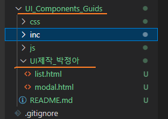
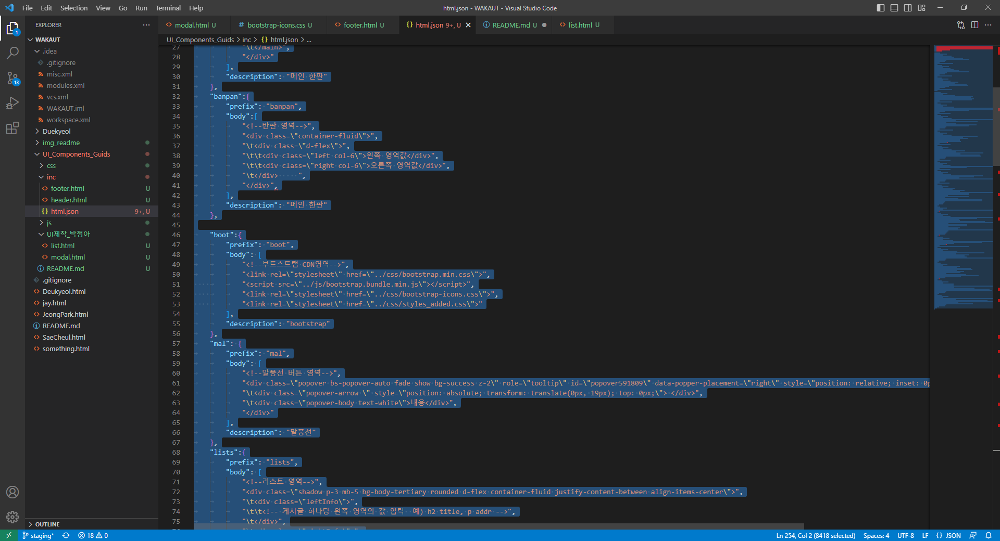
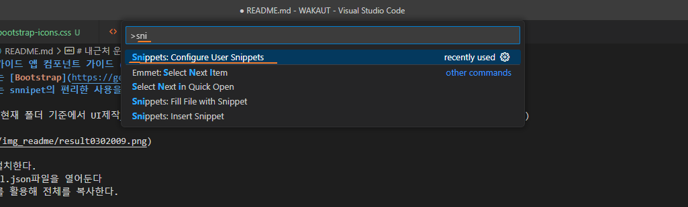
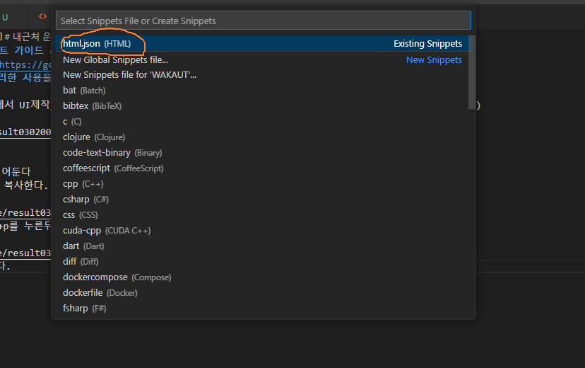
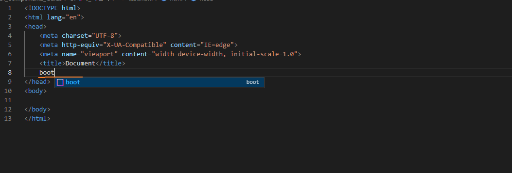
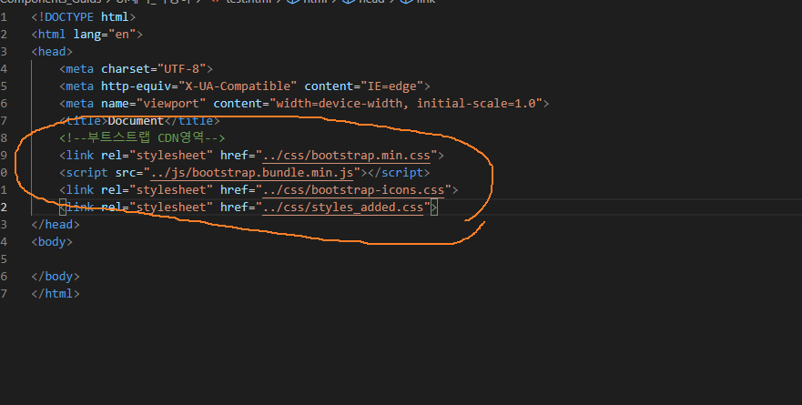
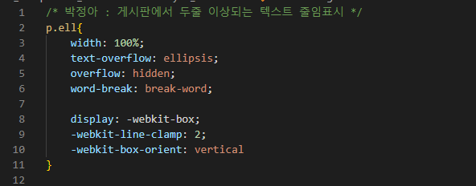

# 내근처 운동 가이드 앱 컴포넌트 가이드 (UI)
+ 모든 가이드는 [Bootstrap](https://getbootstrap.com/) 5.3ver을 기반으로 한다.
+ 사용 에디터는 snnipet의 편리한 사용을 위하여 VSCODE를 활용한다. 


## 목차 
1. [설치 가이드](#설치-가이드)
    1. [파일생성 형식](#파일생성-형식)
    2. [스니펫 설정](#스니펫-설정)

2. [사용 가이드](#사용-가이드)
    1. [기초 사용방법](#기초-사용방법)
    2. [스니펫 단축키 설명](#스니펫-단축키-설명)

## 설치 가이드
### 파일생성 형식
*  모든 작업은 현재 폴더 기준에서 UI제작_이름 형식으로 작성하여 작업한다. (branch는 반드시 본인 branch사용 staging사용 금지)
> 예시<br>
>  <br>

### 스니펫 설정
1. inc/html.json파일을 열어둔다
2. ctrl+a를 활용해 전체를 복사한다.
> 예시<br>
>  <br>
3. VSCode에서 ctrl+shift+p를 누른뒤 sni를 검색하고 snippet 클릭한다.
> 예시<br>
>  <br>
4. html snippet 선택한다.
> 예시<br>
>  <br>
5. 전체를 아까 2.에서 복사한 내용으로 업데이트 한다.
6. 테스트해본다 (html파일 만들고 boot 작성 후 탭)
> 예시<br>
>  <br>
>  <br>


## 사용가이드   

### 기초 사용방법
1. VSCODE에서 반드시 emmet확장자가 필요하다.
2. 하나의 큰 덩어리를 잡을땐 pan을 사용한다.
3. 그리드 안 하나의 큰 덩어리가 반으로 나눠졌더라도 pan을 사용한 뒤 그 안에 banpan을 추가한다.
4. 필요한 CSS는 bootstrap가이드를 준수하며, 만약 태그가 부득이하게 추가되어야한다면 /css/style_added.css에 본인 이름과 추가한 내용을 쓴다.
> 예시<br>
>  <br>


### 스니펫 단축키 설명

| 단축키명 | 설명 |
| --- | --- |
| boot | 부트스트랩 기초세팅 head안에 들어옴 |
| pan | 그리드기초 |
| banpan | 그리드 내 반으로 나뉨 |
| mainpan | 그리드 메인 |
| mal | 말풍선 |
| lists | 게시판리스트(쉐도우있는 블럭) |
| sel | 셀렉트 |
| paging | 페이징 |
| lab | 레이블(리뷰나 커뮤니티등 들어갈 라벨들) |
| alert | 최상단 알림창 |
| search | 검색영역 |
| btn | 버튼 |
| modal | 모달기본 |
| modalBtn | 모달 실행버튼 |
| upimg | 위 이미지 아래 텍스트 구조 |
| txts | 옆으로 나열되는 텍스트 |
| brdTxt | 게시판 내 텍스트 |
| inptxt | 인풋태그 |


### 컬러참조(bootstrap)
> 예시<br>
>  <br>

```html
<span class="badge text-bg-primary">Primary</span>
<span class="badge text-bg-secondary">Secondary</span>
<span class="badge text-bg-success">Success</span>
<span class="badge text-bg-danger">Danger</span>
<span class="badge text-bg-warning">Warning</span>
<span class="badge text-bg-info">Info</span>
<span class="badge text-bg-light">Light</span>
<span class="badge text-bg-dark">Dark</span>
```


### 마진 참조 
* 만약 왼쪽이나 위쪽으로 공간을 두고 싶다면 다음 가이드를 참조한다.
* 마진은 요소와 요소의 사이를 '배경없이' 떨어트리고 싶을 때 사용 
* 패딩은 특정 요소안에 요소들을 '배경유지' 하면서 떨어트리고 싶을 때 사용

```html
.mt-0 {
  margin-top: 0 !important;
}

.ms-1 {
  margin-left: ($spacer * .25) !important;
}

.px-2 {
  padding-left: ($spacer * .5) !important;
  padding-right: ($spacer * .5) !important;
}

.p-3 {
  padding: $spacer !important;
}
```
