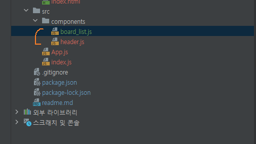

## 개발가이드 
### 컴포넌트 제작방법 
#### 저장위치
+ src>components 폴더 안에 js파일로 생성한다.
>예시 <br>
> <br>

#### 선언방법 
+ 함수형으로 선언한다.
+ 선언된 부분의 내용은 wrap을 제외한 안의 부분을 묶어서 저장한다.
+ 예) <div class=cntWrap>안의 div class=content>라면, <div class="content>부터 시작하면 된다.
```javascript
import {Form,InputGroup,Nav,Navbar,Container,Button} from 'react-bootstrap';
const Content = ()=>{
    return(
        <div className="contnet">
            내용 추가 
        </div>
    )
}
export default Content;

```
#### 제작방법 
+ 제작은 [bootstrap react](https://react-bootstrap.github.io/getting-started/introduction)로 제작한다.
+ 모든 CDN은 index.html에 고정으로 지정되어있기때문에 필요한 모듈만 import해서 사용하면 된다.
+ 추가적인 모듈은 bootstrap 홈페이지에서 확인한다.
```javascript
    import {Form,InputGroup,Nav,Navbar,Container,Button} from 'react-bootstrap';
```

#### 확인방법 
+ 확인은 App.js에서 라우터를 설정하여 확인할 수 있다.
```javascript
import 페이지컴포넌트 from './pages/페이지컴포넌트파일명'
<Route path='경로' element={페이지컴포넌트} />
```
+ 예시
```javascript
import BoardList from './pages/board_list';
import {Routes,Route} from "react-router";
import NotFind404 from './pages/NotFind404';
import Main from './pages/main';
import Boardview from './pages/boardview';

const App=()=>{
    return (
        <div>
            <Routes>
                <Route path='/' element={<Main />} />
                <Route path='/boardlist' element={<BoardList />} />
                <Route path='/boardview' element={<Boardview />} />
                // 404파일 바로 위에 추가하며, 어떤 경로를 거칠 때 어떤 페이지가 보여지는지 설정하면 된다.
                <Route path='/*' element={<NotFind404 />} />
            </Routes>
        </div>
    )
}

export default App;
```

#### 헤더에 업데이트 하는방법 
+ 위의 [확인방법](#확인방법)에서 작성한 내용을 헤더에 추가하고 싶다면 index.js를 수정하면 된다.
```javascript
import React from 'react';
import ReactDOM from 'react-dom';
import App from './App';
import Header from "./pages/header";
import Footer from "./pages/footer";
import {BrowserRouter as Router} from "react-router-dom";


ReactDOM.render(
  <React.StrictMode>
    <Router>
    // 여기에서 menu안에는 메뉴명이 들어가고 route안에는 경로가 들어가며, route안에 설정한 경로는 [확인방법](#확인방법) 에서 설정한 경로와 일치해야 한다.
    // 메뉴를 하나씩 배열뒤에 추가하면 되며 ,로 구분하여 추가한다. (앞의 내용은 절대 건들이지 말것.) 또한, menu에 배열이 추가되면 반드시 route에도 같은 index번호 값에 값이 추가되어야 한다.
      <Header menu={['mypage','community','login/signin']} route={['/mypage','/boardlist','/login']}/>
      <App />
      <Footer />
    </Router>
  </React.StrictMode>,document.getElementById('root')
);


``` 


### 폴더설명
+ public : index및 favicon이 위치하므로 절대 손대지 말 것 
+ src 
    + assets: 이미지 및 동영상 파일
    + components : UI컴포넌트 단위만 함수형으로 생성해서 올릴것 
    + pages : 페이지를 의미하며 components에서 마음껏 불러와서 사용할 수 있음 
    + services : api파일들만 업로드 

### 작업영역
+ 작업영역은 크게 components와 pages로 나뉨 
+ components는 한 개 이상 반복되는 모듈을 저장하는곳 
+ pages는 페이지를 제작하는 곳
+ 모든 폴더안의 내용은 js파일로 함수형으로 작성할 것 

### 서버영역, 클라이언트 영역 구분 
+ 서버영역과 클라이언트 영역은 무언가 수정하였을때 서버를 다시 가동해서 확인할 수 있는 것들은 서버영역 
+ 서버를 가동하지 않고 이미 가동 된 서버에서 새로고침을 하여 확인할 수 있는것들은 클라이언트 영역이다.


### 함수사용 가이드 
#### kakao share api
+ 카카오 지도위치 api는 모듈화 되어있으므로 사용하고자 하는곳에 import로 불러오면 된다.
+ 카카오 모듈을 불러온 뒤 argument값에 각각 addr, title, des, img, likes등을 넣어주면 되며, 만약 생략된다면 '' 빈 값을 넣어주면 된다.

| 아이디 | 설명 |
| --- | --- |
| title | 지역명의 제목에 해당한다 |
| addr | 주소에 해당하며 반드시 옳은 주소를 입력해야 지도 위치를 공유할 수 있다. |
| des | 해시태그를 의미하며 없어도 무방하다. 또한, 해시태그가 아니여도 설명을 입력할 수 있다. |
| img | 공유할 이미지를 의미하며, 이미지 속성에 들어갈 경로가 입력되면 된다. |
| likes | 현재받은 별점을 의미하며 숫자의 값이 들어간다. |

+
```javascript
import kakaoShare from '../services/kakaoShare';
function component(){
    return(
        <Button variant="warning" className='fluid ms-2' 
        onClick={()=>{kakaoShare({'addr':props.addr, 'title':props.title, 'des':props.des, 'img':props.img, 'likes':props.score})}}>카카오 공유하기</Button>
    )
}
export default component;

```


### 컴포넌트 사용방법 
#### Modal 
+ 모달 페이지 만들기
```javascript
// 모달을 import한다.
import Modal from '../components/modal';

const WriteModal=(props)=>{
    return(
        // 모달페이지가 사용되는 곳에서 반드시 props로 lgShow와 setLgShow값을 넘겨 받아야한다.
        <Modal lgShow={props.lgShow} setLgShow={props.setLgShow} title="모달에 들어갈 타이틀 입력">
            // 이 안에 내용을 입력한다.
        </Modal>
    )
}

export default WriteModal;

```

+ 버튼 클릭하면 모달페이지 가져오기
```javascript
import { useState } from "react";
import PlaceModal from "./place_modal";

const Main=()=>{
    const [lgShow, setLgShow] = useState(false);
    return(
        <>
            <div className="left col-6">
                <List title='부천 종합 운동장' .... textClick={()=>{ setLgShow(true)}}></List>
            </div>

            //만든 모달을 불러오고 useState로 선언한 lgShow와 setLgShow를 반드시 넘겨준다.
            <PlaceModal lgShow={lgShow} setLgShow={setLgShow} />
        </>   
    )
}
export default Main;
```

### List

| 파라미터값 | 의미 |
|---|---|
|title | 글제목 |
|malcnt | 말풍선 안 들어갈 내용 |
|note | title 바로 아래 내용 |
|col | 말풍선 컬러 (부트스트랩 bg-컬러명 입력) |
|textClick | 텍스트 클릭 시 발생하는 함수 |
|to | 링크이동 경로 |
|kd | review 혹은 community 배지, 없어도 됨 |
|time | 작성일자 없어도 됨  |
|img | true: 이미지 있음 false: 이미지 없음 |

>  이런 모습의 컴포넌트를 쓰고 싶다면 사용한다.
```javascript
//list를 import한다.
import List from "../components/list";

// 이렇게 불러오면 되며, 여기에 사용되는 값은 표를 참조한다.
 <List title='부천 종합 운동장' malcnt={<AiTwotoneHeart />} note="경기도 부천시 소사로482" col='bg-secondary' textClick={()=>{ setLgShow(true)}} img={true} col='bg-warning' time='2023-03-07' kd='review' to="/boardview"/></List>
```    

### search 
+ 아래와 같은 이미지의 모습일때 사용가능하며, 버튼 개수는 조절이 가능하다.
> 

| 파라미터값 | 의미 |
|---|---|
|cat | 카테고리 배열로써 ,로 구분하며 배열개수에따라 option값이 늘어난다. |
|btn | 우측의 버튼으로 배열개수에따라 버튼 개수가 늘어난다. |
|btncol | btn에서 입력한 값과 동일한 index의 개수로 bootstrap에서 사용하는 버튼 컬러를 넣어주면 된다. |
|click | 버튼개수에따라 발생하는 이벤트로, 이벤트가 없으면 false표시 / 있다면 ()=>{함수 안에 진행함수를 넣어준다.} |

```javascript
import Search from '../components/search';

 <Search cat={['content','review']} btn={['검색하기','새글쓰기']} btncol={['secondary','success']} click={[false,()=>{setLgShow(true)}]}/>
```


### pagenation 
+ 페이지네이션으로, 아래와 같이 사용한다.
+ cnt안에 넣는 숫자만큼 페이지 개수가 늘어난다.

```javascript
import Paging from '../components/pagenation';

<Paging cnt={5}/>
```

### selection 
+ 셀렉트 자동화 함수로 option의 값이 늘어난다.
+ cat안에 배열로 값을 넣어주면 넣어주는 개수만큼 늘어난다
+ title은 select에서 제일 처음으로 보여주는 option의 값이다.
```javascript
import Selection from './selection';

<Selection  title='카테고리 선택' cat={['comments','nanana']}/>
```

### alert
+ 위에 한줄로 보여지는 alert이다
+ color에는 부트스트랩 기준 배경색을 넣으면 된다 
+ msg에는 메세지를 넣으면 된다.

```javascript
import Alerts from '../components/alert';
<Alerts color='success' msg='해당 게시판은 관리자에의해 실시간 관리되고있습니다. 허위사실유포 및 부적절한 표현은 차단될 수 있습니다.'/>
```